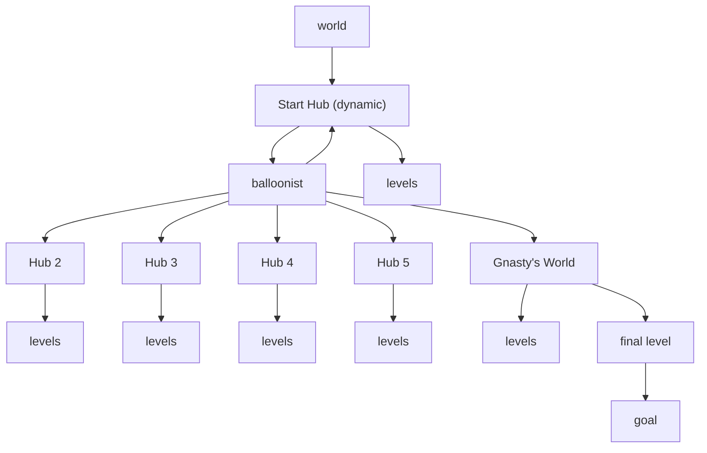

---

[TOC]

---

# 20260712

## Move Randomization Prerequisites

!!! greysondn "greysondn - Re: Move randomization"
    One of gamefreq0's goals is move randomization. That requires us
    to have certain things done.

* Issues
    * Player can end up in a world where they cannot get to the balloonist.
        * Examples
            * Dream Weavers without glide
            * Magic Crafters without charge
            * Beast Makers without jump (if we even do that one)
        * Solution
            * Archipelago assumes that you can return to starting possition
            * Player just starts a new game to get back to starting position
        * QOL outlay
            * We need to init the collectibles so the player is in the exact
              same state in a newgame.
            * Requires knowing where all the gems are in memory.
                * Literally means gemsanity will probably happen before move
                  randomization.

## World Map Redesign

!!! greysondn "greysondn - Re: World Map"
    Prior world map was complicated by excess connections. A minimal case
    is simpler and requires much less custom code. This is that map.

